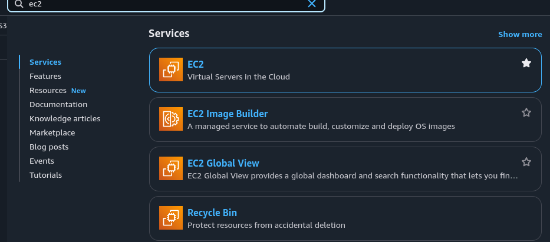
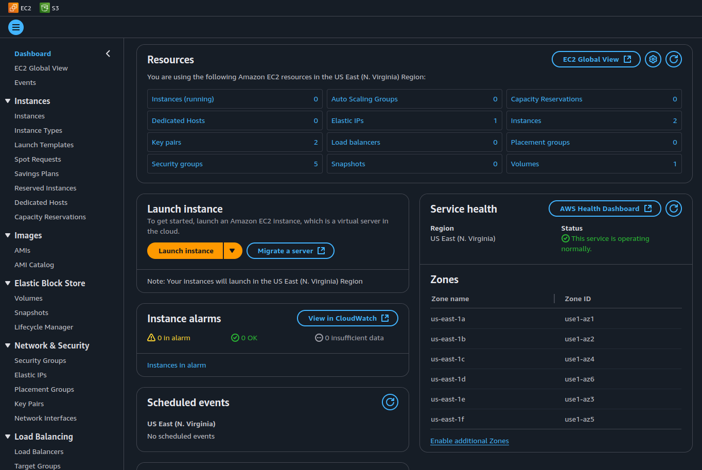
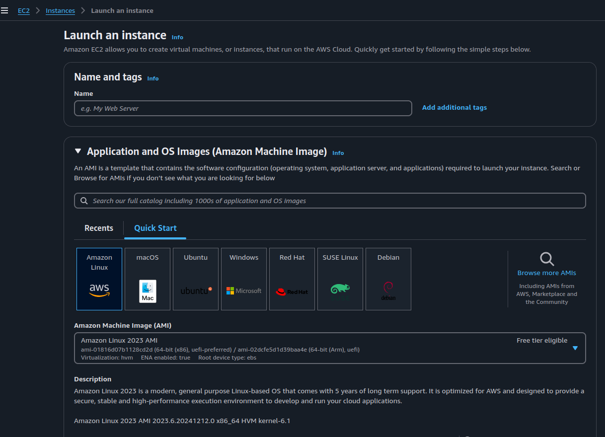
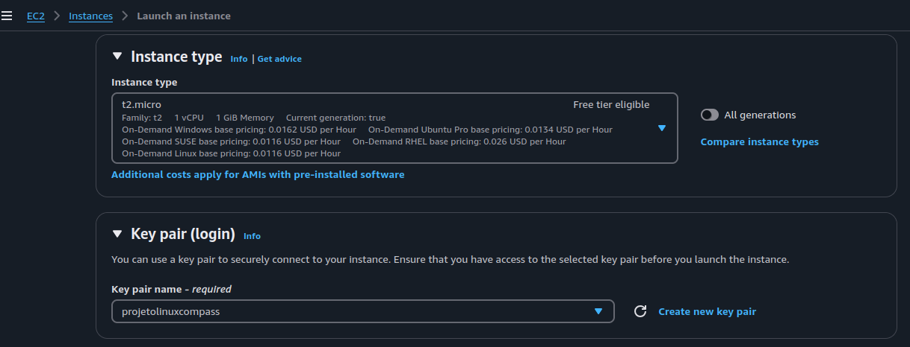
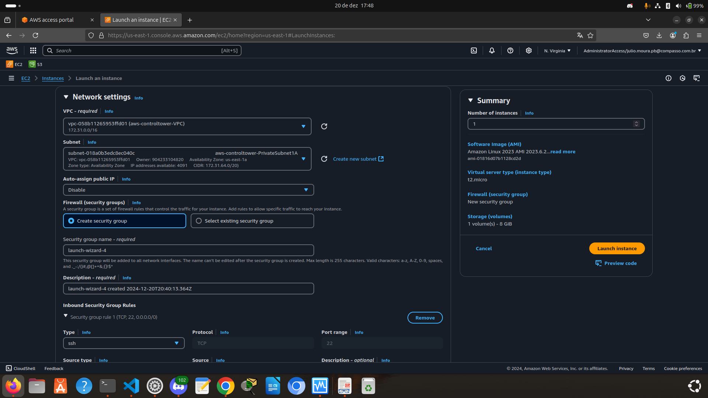
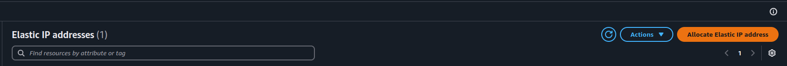
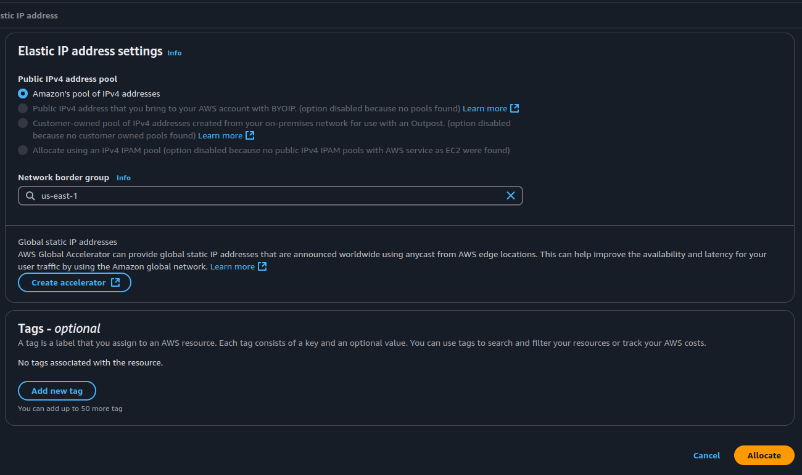
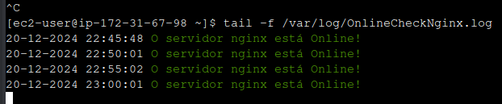
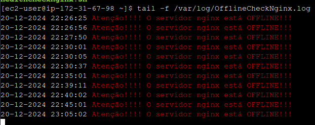

# Compass-PB-NOV2024-Linux

Atividade pede que para Criar um ambiente Linux no Windows:
Utilizando o WSL do Windows, crie um
subsistema do Ubuntu 20.04 ou
superior.

Para fazer isso, você pode usar o Windows Subsystem for Linux (WSL). 
Abaixo nesse readme estão os passos para instalar o Ubuntu usando o PowerShell:

Precisa abrir o Powershell como admin.

Clique com o botão direito do menu iniciar e selecione o powershell

`wsl --install ` 

Esse comando é para habilitar o WSL.

` wsl --install -d Ubuntu`

O comando acima vai instalar uma Distribuição Linux,
Ubuntu.

Após isso é preciso reiniciar o sistema.

Após reiniciar, abra o Ubuntu a partir do menu Iniciar. Isso iniciará a configuração inicial, onde você criará um nome de usuário e senha para o ambiente Ubuntu.

``` 
uname -a 

lsb_release -a

```

Seguindo esse passo a passo, você terá um ambiente linux no seu windows.

Ambiente Linux:

Por questão de comodidade e para aprimorar os conhecimentos, decidir utilizar a AWS.
A seguir mostrarei o passo a passo de como criar corretamente uma instancia EC2 com Amazon Linux.

Primeiramente vamos criar um internet gateway para a VPC(Virtual Private Cloud).

No painel de navegação à esquerda, clique em "Internet Gateways".
Clique no botão "Create internet gateway".
Insira um nome para o Internet Gateway (opcional) e clique em "Create internet gateway".

**Anexar o Internet Gateway à VPC:**
   - Após criar o Internet Gateway, clique no botão "Actions" e selecione "Attach to VPC".
   - Selecione a VPC à qual você deseja anexar o Internet Gateway e clique em "Attach internet gateway".

**Configurar a Tabela de Rotas:**
   - No painel de navegação à esquerda, clique em "Route Tables".
   - Selecione a tabela de rotas associada à sua sub-rede pública.
   - Clique na aba "Routes" e depois em "Edit routes".
   - Clique em "Add route", insira `0.0.0.0/0` no campo "Destination" e selecione o Internet Gateway no campo "Target".
   - Clique em "Save routes".

Seguindo esses passos, você terá um Internet Gateway criado e anexado à sua VPC, permitindo o tráfego da Internet.

Realizado esse passo a passo acima, agora de fato vamos criar a maquina virtual EC2(Elastic Compute Cloud)

### Criar uma Instância EC2

**Navegar para o Serviço EC2:**
   - Na parte de buscar, digite "EC2".



**Iniciar o Processo de Criação da Instância:**
   Clique no botão "Launch Instance".



**Escolher uma AMI (Amazon Machine Image):**



**Escolher o Tipo de Instância:**
   
Selecione o tipo de instância, como "t2.micro" que é elegível no Free Tier(nível gratuito).

Escolha um par de chaves existente ou crie um novo par de chaves para acessar a instância via SSH.



**Configurar os Detalhes da Instância:**

   Configure os detalhes da instância conforme necessário. Certifique-se de selecionar a VPC e a sub-rede corretas.

   Configure o Security Group para permitir o tráfego necessário (por exemplo, SSH na porta 22).




**Adicionar Tags:**

Adicione tags para organizar e gerenciar seus recursos.

**Alocar um IP Elástico:**
    - No painel de navegação à esquerda, clique em "Elastic IPs".
    - Clique no botão "Allocate Elastic IP address".
    - Clique em "Allocate" para confirmar a alocação.





**Associar o IP Elástico à Instância:**
    - Após alocar o IP elástico, selecione o IP na lista e clique no botão "Actions".
    - Selecione "Associate Elastic IP address".
    - No campo "Instance", selecione a instância EC2 que você deseja associar ao IP elástico.
    - Clique em "Associate" para confirmar.

Seguindo esses passos, você terá uma instância EC2 criada e associada a um IP elástico, pronta para uso.

Para se conectar com a instancia via SSH.

No terminal, navegue até o diretório onde o arquivo de chave está localizado e execute:


```sh
chmod 400 chaveGerada.pem

ssh -i chaveGerada.pem ec2-user@<ippublicoEC2>
```

Para saber se tá com acesso a internet pode rodar o comando:

```
ping 8.8.8.8
```

### Atualizando...

```
sudo yum update
```

### Instalando o servidor Nginx

Comando para instalar o nginx, habilitar e realizar o start do serviço.

```
sudo yum install nginx -y
```

```
sudo systemctl enable nginx
```

```
sudo systemctl start nginx
```

### Script de Verificação de Saúde do Nginx

O script `healthnginx.sh` verifica o status do serviço Nginx e registra o resultado em arquivos de log.

#### Conteúdo do Script

```bash
#!/bin/bash
dataBR=$(date "+%d-%m-%Y %H:%M:%S") # - data Atual no formato dia/mes/ano
SERVICE="nginx"
vermelho='\033[0;31m' - # Cor vemelho
verde='\033[0;32m' - # Cor verde
semcor='\033[0m' -  # Sem cor

if [ "$(systemctl is-active $SERVICE)" = "active" ]; then
  echo -e "$dataBR ${verde}O servidor $SERVICE está Online!${semcor}" >> /var/log/OnlineCheckNginx.log
else
  echo -e "$dataBR ${vermelho}Atenção!!!! O servidor $SERVICE está OFFLINE!!!${semcor}" >> /var/log/OfflineCheckNginx.log
fi

```

Se o serviço está ativo o script vai mandar para o diretório /var/log (OnlineCheckNginx.log)



Se o serviço está inativo o script vai mandar para o diretório /var/log (OfflineCheckNginx.log)



É preciso dar permissão de execução.

` chmod +x healthnginx.sh `

Para finalizar a atividade pede que essa verificação seja automatizada.

Vamos utilizar o famoso crontab.

```
sudo yum install cronie -y
```
# Iniciar e habilitar o serviço crond
```
sudo systemctl start crond
sudo systemctl enable crond
```

Para editar o crontab:

`crontab -e`

*/5 * * * * /home/ec2-user/healthchecknginx.sh

Vai verificar o status do nginx a cada 5 minutos.

## Melhorias

# Observabilidade

Poderia criar uma aplicação para observar se esse arquivo de log está corretamente no diretório e "avisar" em um canal no telegram, discord, slack. 
Utilizando tecnologias como Prometheus e Grafana.